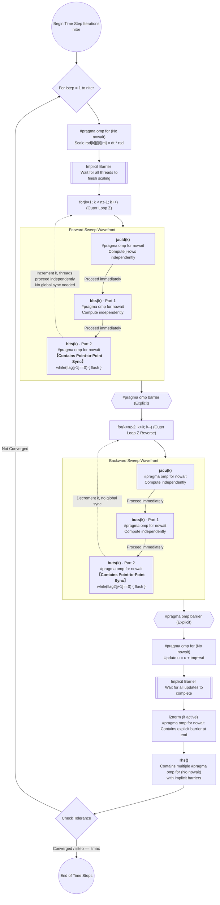

```mermaid
flowchart TD
    Start((Begin Time Step Iterations <br> niter)) --> IterStart{"For istep = 1 to niter"}
    
    IterStart --> ScaleRSD["#pragma omp for (No nowait)<br>Scale rsd[k][j][i][m] = dt * rsd"]
    ScaleRSD --> Barrier0[["Implicit Barrier <br> Wait for all threads to finish scaling"]]
    
    Barrier0 --> ForwardSweepOuter["for(k=1; k < nz-1; k++) (Outer Loop Z)"]
    
    %% Forward Sweep
    subgraph Forward_Sweep_Wavefront [Forward Sweep Wavefront]
        direction TB
        F_JacLD["<b>jacld(k)</b><br>#pragma omp for nowait<br>Compute j-rows independently"]
        F_BltsPart1["<b>blts(k)</b> - Part 1<br>#pragma omp for nowait<br>Compute independently"]
        F_BltsPart2["<b>blts(k)</b> - Part 2<br>#pragma omp for nowait<br><b>【Contains Point-to-Point Sync】</b><br>while(flag[j-1]==0) { flush }"]
        
        F_JacLD -->|Proceed immediately| F_BltsPart1
        F_BltsPart1 -->|Proceed immediately| F_BltsPart2
    end
    
    ForwardSweepOuter --> Forward_Sweep_Wavefront
    F_BltsPart2 -.->|Increment k, threads proceed independently<br>No global sync needed| ForwardSweepOuter
    
    Forward_Sweep_Wavefront ----> Barrier1{{"#pragma omp barrier (Explicit)"}}
    
    Barrier1 --> BackwardSweepOuter["for(k=nz-2; k>0; k--) (Outer Loop Z Reverse)"]
    
    %% Backward Sweep
    subgraph Backward_Sweep_Wavefront [Backward Sweep Wavefront]
        direction TB
        B_JacU["<b>jacu(k)</b><br>#pragma omp for nowait<br>Compute independently"]
        B_ButsPart1["<b>buts(k)</b> - Part 1<br>#pragma omp for nowait<br>Compute independently"]
        B_ButsPart2["<b>buts(k)</b> - Part 2<br>#pragma omp for nowait<br><b>【Contains Point-to-Point Sync】</b><br>while(flag2[j+1]==0) { flush }"]
        
        B_JacU -->|Proceed immediately| B_ButsPart1
        B_ButsPart1 -->|Proceed immediately| B_ButsPart2
    end
    
    BackwardSweepOuter --> Backward_Sweep_Wavefront
    B_ButsPart2 -.->|Decrement k, no global sync| BackwardSweepOuter
    
    Backward_Sweep_Wavefront ----> Barrier2{{"#pragma omp barrier (Explicit)"}}
    
    Barrier2 --> UpdateU["#pragma omp for (No nowait)<br>Update u = u + tmp*rsd"]
    UpdateU --> Barrier3[["Implicit Barrier <br> Wait for all updates to complete"]]
    
    Barrier3 --> L2NormUpdate["l2norm (if active) <br>#pragma omp for nowait <br>Contains explicit barrier at end"]
    L2NormUpdate --> RHS_Recompute["<b>rhs()</b><br>Contains multiple #pragma omp for (No nowait)<br>with implicit barriers"]
    
    RHS_Recompute --> TolCheck{"Check Tolerance"}
    TolCheck -- "Not Converged" --> IterStart
    TolCheck -- "Converged / istep == itmax" --> EndIter((End of Time Steps))
```